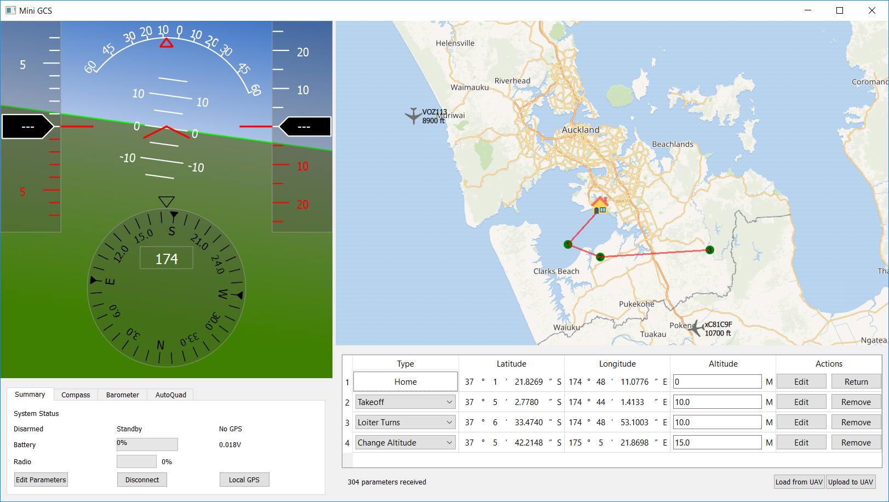

# MiniGCS
MiniGCS is a handheld MAVLink compatible drone control station

This project is in early stage, contents will be added later

## GCS Software

The GCS is a PyQT GUI application features realtime telemetry monitoring and mission planning.

**Screenshot**

